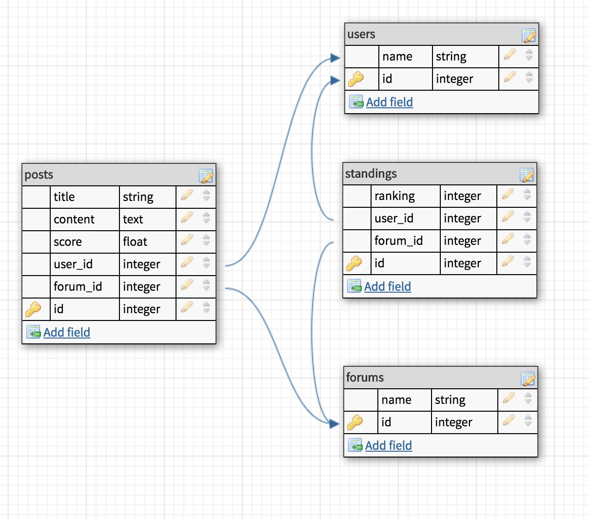

# Intermediator gem

#### Description
The intermediator gem applies a unique system to forum-based applications in order to better combat meaningful content being buried from traditional democratic voting systems.

To better understand the underlying problems with current systems, this video by the PBS Idea Channel explains the inherent issues that arise from traditional forum democracy:

https://www.youtube.com/watch?v=UJdLl8qLgeU&list=WL&index=4  

Traditional democracy is a fair system in theory but not necessarily egalitarian due to the bias of voters, and systematically appealing to specific user bases with content that is likely to be upvoted. Content that is likely to be upvoted is what people want to see, but not necessarily what people _need_ to see, there could be piles of content that people didn't even know they wanted to see, or discussions that they could have a crucial voice in, however these posts sometimes never see the light of day.   

